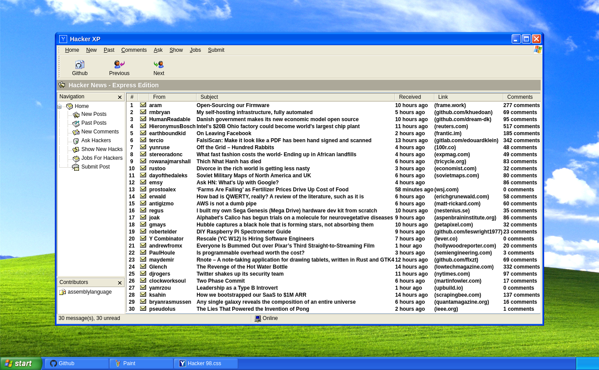

# Hacker XP

_Hacker News styled as the Windows XP Outlook email client._

[Try out Hacker XP here!](https://hackerxp.com)

[](https://hackerxp.com)

## Description

This is an unofficial front end for [Hacker News](https://news.ycombinator.com/news), reminiscent of the Windows XP era Outlook email client on a Windows XP default desktop. The front end is written in [TypeScript](https://www.typescriptlang.org/) using the [Next.js](https://nextjs.org/) framework, with pages rendered server side to match the rendering method used on Hacker News.

### Building and Running Locally

You can build the client and run locally using these commands:

```sh
git clone https://github.com/assemblylanguage/hacker-xp.git
cd hacker-xp
npm install
npm run build
npm run start
```

Once the server starts, you can access the front end at the local host address [http://localhost:3000](http://localhost:3000).

### License

Code licensed under the GNU AGPLv3. This project is not affiliated with Microsoft or Y Combinator.
